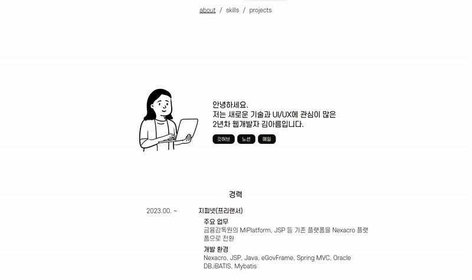

# 2024 Portfolio

> React18 연습 및 2024년까지의 프로젝트를 한번에 정리하기 위하여 개발.

### **개발환경**

- React18, Node.js v20, Scss

### **주요기술**

- useState(), useRef(), useEffect()
- map()을 활용한 UI

# 화면

🐣 캐릭터를 클릭하면 눈깜빡이는 애니메이션 추가

  

